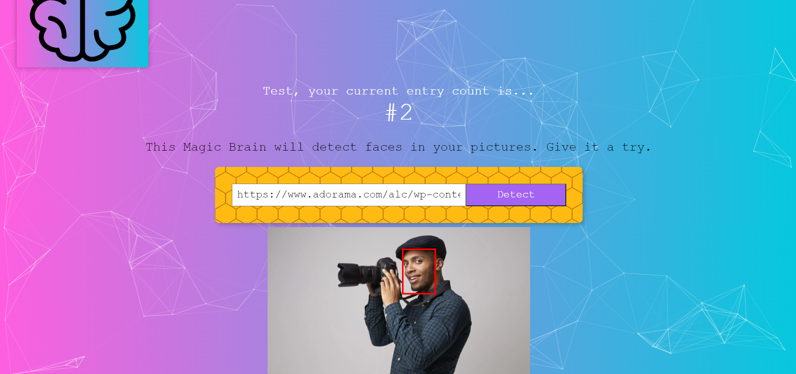

# Face Detection App

## About

Full-stack React.JS web app that uses a Machine Learning API from Clarifai to identify faces on images.

Allows users to create accounts and login to track number of images processed.

## Screenshot



## Getting Started

- Fork and clone this repository

### Server:

- Setup PostgreSQL

```
cd server && npm install
```

```
npm start
```

### Client:

```
cd client && npm install
```

```
npm start
```

## Tech Stack

- React
- React Hooks
- Node.js
- Express.js
- PostgreSQL
- Clarifai API
